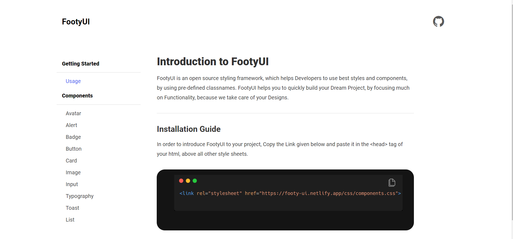

# FootyUI Component-library

### FootyUI is a free, open-source framework that provides ready-to-use frontend components that you can easily combine to build responsive interface.

# Installation

```css
<link rel="stylesheet" href="https://footy-ui.netlify.app/css/components.css">

```

## Footy UI contains the following components

- [Alert](#alert)
- [Avatar](#avatar)
- [Badge](#badge)
- [Button](#button)
- [Card](#card)
- [Image](#image)
- [Input](#input)
- [List](#list)
- [toast](#toast)
- [Typography](#typography)

---

## [Alert](https://footy-ui.netlify.app/components/alert/alert)

Alert is used to display important message to the user.

There are different types of Alerts present in the library.

- primary Alert
- Success Alert
- Error Alert
- Warning Alert

## [Avatar](https://footy-ui.netlify.app/components/avatar/avatar)

Avatar is used to display the image of a user.

There are different types of Avatars present in the library.

- Profile Avatar
- Different sizes of Avatar
- Square Avatar

## [Badge](https://footy-ui.netlify.app/components/badges/badge)

Badge is used to display the status(online or offline) of the user or for notification count.

There are different types of Badges present in the library.

- Badges on Avatars
- Badges on Icons

## [Button](https://footy-ui.netlify.app/components/button/button)

Buttons are used to make a web app interactive and to make user take an action.

There are different types of Buttons present in the library.

- Primary Button
- Link Button
- Icon Button
- Floating Button

## [Card](https://footy-ui.netlify.app/components/card/card)

Card is essentially used in ecommerce or video library or social media regarding one piece of information.

There are different types of Crads present in the library.

- Vertical Card
- Shadow Card
- Text Card
- Text Overlay Card
- Horizontal Card
- Ecommerce Product Card

## [Image](https://footy-ui.netlify.app/components/image/image.html)

Image is used to display large image on the website.

There are different types of Images present in the library.

- Responsive Image
- Circle Image
- Square Image

## [Input](https://footy-ui.netlify.app/components/input/input.html)

Input is used to ask a piece a piece of information from the user.

There are different types of Inputs present in the library.

- Basic Input
- Error Input

## [Typography](https://footy-ui.netlify.app/components/typography/typography.html)

Typography is used to format text in a website.

There are different types of Typography examples present in the library.

- Heading
- Sizes
- Alignment
- Extra Styles

## [Toast](https://footy-ui.netlify.app/components/toast/toast.html)

Toast is used to show popped up message to the user after a certain action is done by user.

There are different types of toasts examples present in the library.

- Primary
- Success
- Failure

## [List](https://footy-ui.netlify.app/components/list/list.html)

List is used to display choices inside a heading to the user.

There are different types of List present in the library.

- Simple List
- Stacked List

## [Navigation](https://footy-ui-temp.netlify.app/components/navbar/navbar)

Navigation is used to navigate to different sections or pages of a website.

## [Modal](https://footy-ui-temp.netlify.app/components/modal/modal)

Modal is used to ask an action among choices from a user.

## [Grid](https://footy-ui-temp.netlify.app/components/grid/grid)

Grid is used to divide a web page into sections.

There are two items and three items grid present in the library.

- Two Items Grid
- Three Items Grid

## [Rating](https://footy-ui-temp.netlify.app/components/ratings/ratings.html)

Rating is used to ask a rating or a service or product from a user.

There is a single rating present in the library.

- Simple Rating

## Desktop Version


